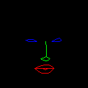
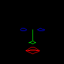
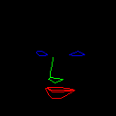

# face alignment and landmark preprocessing

The script is very dirty because it is a script I made for temporary use. But it does work.

Image preprocessing for [FaceGAN](https://github.com/MakeDirtyCode/FaceGAN)

## Requirements

- Python3
- Pytorch
- opencv-python
- numpy

## Usage

crop
```
python crop.py --dataset=dataset_dir --save=save_dir
```

landmark extract
```
python landmark.py --dataset=dataset_dir --save=save_dir
```

## Result

crop


landmark







## Reference

[face_alignment](https://github.com/1adrianb/face-alignment)

[matlab_cp2tform](https://github.com/clcarwin/sphereface_pytorch)